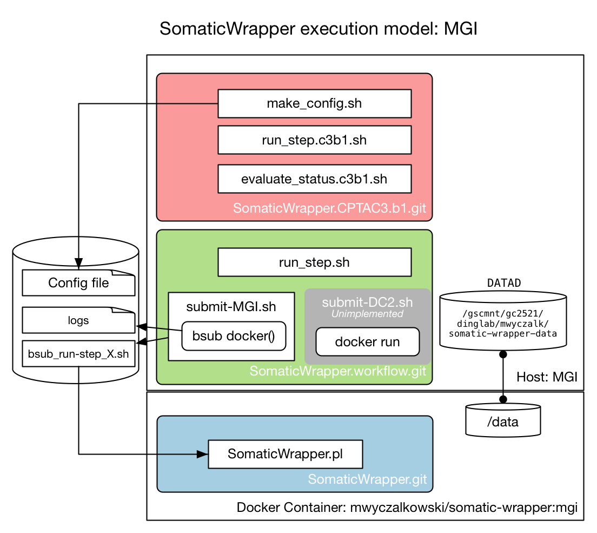

Driver scripts for CPTAC3 Batch 1 SomaticWrapper analysis at MGI

# TODO:

* Add documentation about BamMap
* Implement BamMap Jan18 version
* Implement documentation suggestions from AK

## Additional notes
Docker implementation borrowed from `/Users/mwyczalk/Data/CPTAC3/importGDC.CPTAC3.b1`

```
# LSF_GROUP must be set as environment variable with e.g.,
# export LSF_GROUP="/mwyczalk/gdc-download"  
```

# SomaticWrapper Overview

The SomaticWrapper analysis package is divided into three separate projects:

* [SomaticWrapper](https://github.com/ding-lab/somaticwrapper/tree/docker) core.  This includes
  * Scripts to run and merge output from various SV variant callers and other bioinformatics tools
  * A Dockerfile which generates an image containing all software used in analysis
  * Scripts which download and generate all data dependencies for installation (references, etc)
  * SomaticWrapper executes in a series of steps, with all configuration specified in config file
  * Currently, must use the `docker` branch.
* [SomaticWrapper.workflow](https://github.com/ding-lab/SomaticWrapper.workflow).
  * Simple workflow implementation for SomaticWrapper to initialize, launch, and track analysis jobs, including their dependencies
  * Works on standard Docker enviroments (DC2) as well as at MGI
* [SomaticWrapper.CPTAC3b1](https://github.com/ding-lab/SomaticWrapper.CPTAC3.b1)
  * Driver scripts for CPTAC3 Batch 1 SomaticWrapper analyses
  * Simple wrappers which call SomaticWrapper.workflow
  * All locale- and project-specific information (paths, etc) defined here.
  * Most users will need to make changes only to files at this level

# Data prerequisites
## BamMap 

BamMap files are generated during the download process and provide information about sequence data
(FASTQ or BAM) including their path.  They are generated by e.g. [importGDC.CPTAC3.b1](https://github.com/ding-lab/importGDC.CPTAC3.b1)
but for new projects can be made by hand from the example `doc/BamMap.example.dat`.  BamMap columns:
```
     1	SampleName	C3L-00097.WGS.N
     2	Case	C3L-00097
     3	Disease	CCRC
     4	ExpStrategy	WGS
     5	SampType	normal
     6	DataPath	/gscmnt/gc2521/dinglab/mwyczalk/somatic-wrapper-data/GDC_import/data/5433e300-93a8-449d-8ba9-160bcb196f6f/CPT0003920002.WholeGenome.RP-1303.bam
     7	FileSize	131756190552
     8	DataFormat	BAM
     9	Reference	hg19
    10	UUID	5433e300-93a8-449d-8ba9-160bcb196f6f
```

*Note, versions of BamMap used for batch 1 did not have file size as a column*
*TODO* Provide example BamMap with RNA-Seq, WGS, WXS data

## Directory structure overview

*Note that directory structure expanded to 3-volume format February 2018*

There are three volumes which are mapped to the docker container to use for SomaticWrapper:

* `/data`: configuration, log, and SomaticWrapper output.  Defined by `DATAD_H` in `sw.config.dat`
* `/import`: Where input from BamMap resides.  Mounted as read only.  Because the data may live on different drives for different samples even in same
batch, the `IMPORTD_H` directory is generated dynamically by finding the greatest common path between the somatic and tumor datasets.
For instance, if tumor BAM is `/usr/local/tum/tum.bam` and normal `/usr/local/nor/nor.bam`, `IMPORTD_H` would be `/usr/local` and
the container paths would be `/import/tum/tum.bam` and `/import/nom/nom.bam`
* `/image`: volume for all data generated by `SomaticWrapper.workflow/somaticwrapper/image.setup/` scripts and any other per-image data.
Defined by `IMAGED_H` in `sw.config.sh`.  Mounted as read only

# SomaticWrapper.CPTAC3.b1 Usage

All configuration which is needed for a specific project - in this case,
somatic variant calling of CPTAC3 Batch 1 WXS samples - is defined in this
project.  Description below illustrates typical usage.

## Prerequisites

You'll need to get a BamMap file to get started, which has paths to BAM files.  See 
[import.CPTAC3b1](https://github.com/ding-lab/import.CPTAC3b1) for details.  *TODO* Describe.

See `doc/BamMap.example.dat` for an example.


## Installation

First, check out copy of [SomaticWrapper.CPTAC3.b1](https://github.com/ding-lab/SomaticWrapper.CPTAC3.b1) with the 
command,
```
git clone --recursive https://github.com/ding-lab/SomaticWrapper.CPTAC3.b1.git
```

This will download your own copy of SomaticWrapper.CPTAC3.b1 into the current directory for you to get started with.
Note that `SomaticWrapper.workflow` is a [submodule](https://git-scm.com/book/en/v2/Git-Tools-Submodules) of `SomaticWrapper.CPTAC3.b1`,
and the core `SomaticWrapper` project is a submodule of `SomaticWrapper.workflow`.

You may want to rename `SomaticWrapper.CPTAC3.b1` to something specific to your project.

## Initialization

Need to download and/or generate data which is used by all SomaticWrapper containers in a given installation.  This is
typically done once per installation, and is done by various scripts in SomaticWrapper directory `somaticwrapper/image.setup`.

*TODO* Describe how this is done.

## Edit path definition file

The script `sw.config.sh` contains all of the paths used for the analysis and must be edited to run a new project.

### Path overview

SomaticWrapper running in a Docker container stores all its analysis data in the `/data` directory, and all
paths that reference `/data` are *container* paths (with names ending in `_C`).  

The `/data` path is mapped to the `DATA_H` directory on the *host* machine (`_H` suffix).  Only files in the subdirectories of 
`DATA_H` will be visible within the docker container.

SomaticWrapper will write to the `SCRIPTD` directory, which is generally project-specific.  Reference and other data shared
by all SomaticWrapper containers will be in the `DATA_H/image.data`. BAM files are stored in `DATA_D/GDC_import`.

## Define project batch

First step to running this workflow is creating a batch (`CASES`) file, which lists all the samples associated with this 
project.  
```
bash 1_make_batch.sh
```
SomaticWrapper will run on each sample in this list, and the sample names must be unique.  Here, we create sample name for each
unique `case` in the `BAM_MAP` file.

## Create configuration files

SomaticWrapper execution is defined by the configuration file, with one configuration file for each sample name created with,
```
bash 2_make_config.sh
```

Data for configuration file comes from two sources:

* A template file, which lists common parameters for a given analysis type.  The `CPTAC3.b1` project uses the template file
`SomaticWrapper.workflow/templates/GRCh37.template` 
* `BAM_MAP` file, which defines paths to tumor and normal BAM data.  Parameters added in `2_make_config.sh` will supercede
those in the template.

Configuration files are saved to `DATA_H/config`.

## Start SomaticWrapper step

SomaticWrapper is run in several steps, with some steps requiting preceding steps to be completed.  No effort is made to automate
the starting of steps in `SomaticWrapper.workflow`, though more sophisticated workflows could.  Instead, `SomaticWrapper.workflow`
provides a couple of tools to make tracking and starting jobs much easier.

### SomaticWrapper workflow steps

SomaticWrapper currently consists of the following steps:

* Step 1:  `run_strelka`
* Step 2:  `run_varscan`
* Step 5:  `run_pindel`
* Step 3:  `parse_strelka`
* Step 4:  `parse_varscan`
* Step 7:  `parse_pindel`
* Step 8:  `merge_vcf`
* Step 10: `run_vep`

To start a step for a given sample name, do,
```
bash run_batch_step.sh -S STEP SN
```

`STEP` can be the number (`1`), name (`run_strelka`) or a collection of steps (`run` and `parse` run the trio `1,2,3` and
`3,4,7`, respectively).

`SN` can be one or more sample names.  If `SN` is `-`, will read a list of sample names from `STDIN`.

## Evaluate SomaticWrapper status

The script `evaluate_batch_status.sh` will obtain the status of all steps associated with all sample names in the batch
file.  We use an ad-hoc approach to test the output files of each step, to see whether it is running, completed, or exited
with an error.  For instance, the following
```
evaluate_batch_status.sh
```
will give back something like the following for each sample name,
```
C3L-00369.WXS	run_strelka:completed	run_varscan:completed	run_pindel:running	parse_strelka:unknown	parse_varscan:unknown	parse_pindel:unknown	merge_vcf:unknown  run_vep:unknown
```

Here, the `run_strelka` and `run_varscan` steps have completed, while `run_pindel` step is still executing.  The parse, merge, and VEP steps
have not been initialized.

The script will also provide a summary view of the status of all samples:
```
evaluate_batch_status.sh -e
```
will give back something like the following,
```
C3L-00361.WXS	merge_ready_to_start
C3L-00369.WXS	runs_incomplete
C3L-00561.WXS	runs_ready_to_start
```

Here, sample `C3L-00361.WXS` is ready for step 8, `C3L-00369.WXS` is still running, and `C3L-00561.WXS` is ready to start the run steps.

The run and evaluate scripts are designed to work together: you can filter status to look for something specific, output only the 
matching sample names, and feed that directly into the run script.  For instance, the following set of commands
will start parsing all jobs which are ready to be parsed:

```
./evaluate_batch_status.sh -e -f parsing_ready_to_start -u | ./run_batch_step.sh -S parse -
```

## Debugging

### Dry stack

The `-d` flag to the `run_step.sh` will result in a *dry run*, which simply outputs the command which would be run.  This flag
can be repeated: `-d` will print output of `run_step.sh`, `-dd` will print output of `submit-MGI.sh`, etc.

### Running `bash` in container

Flag `-B` will execute `bash` in the docker container, rather than `SomaticWrapper.pl`.  All prior steps proceed as normal,
so that configuration files, paths, etc. are set up as normal.  This allows individual SomaticWrapper steps to be run interactively from the command
line.

# Execution Model

The following figure illustrates how the various pieces of SomaticWrapper work together.



